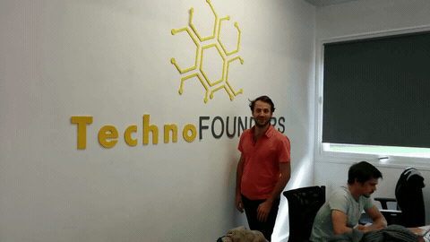
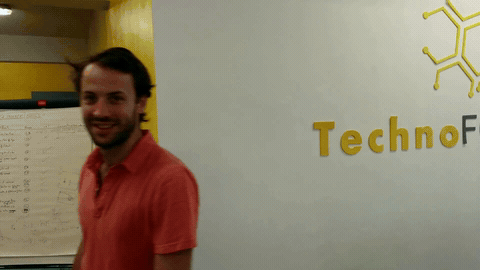

# Video Unscramble (Interview Technical Test)

> AI Engineer technical test solution for Digeiz. One-week implementation.

## Problem

Recover the original temporal order of a corrupted video in an unsupervised setting. The input is a shuffled video built from valid scene frames mixed with unrelated frames. The goal is to reject outliers and reconstruct the most coherent version of the original sequence with a method that generalizes to other similarly corrupted videos.

## Method

Pipeline:

1. `cluster`
   Build frame embeddings, cluster them, and remove outliers.
2. `match`
   Compute pairwise similarity and motion with `AKAZE`, `SIFT`, `RESNET`, or `COMBO`.
3. `sequence`
   Build a transition score matrix and decode the order with a sparse graph + beam search.
4. `reconstruct`
   Write the ordered frames to a video.

Main choices:

- frame filtering: multi-modal embeddings + PCA + Gaussian Mixture + Isolation Forest
- matching: local features (`AKAZE`, `SIFT`) or ResNet spatial features
- decoding: top-k transition graph, beam search, local refinement, frame reinsertion

## Run

Install:

```bash
uv sync
```

Run one method:

```bash
uv run video-unscramble pipeline --method AKAZE --input corrupted_video.mp4 --output-dir results/AKAZE --fps 24 --clusters 2 --alpha 0.5 --viz-tsne
```

Run all methods:

```bash
for method in AKAZE SIFT RESNET COMBO; do
  uv run video-unscramble pipeline --method "$method" --input corrupted_video.mp4 --output-dir "results/$method" --fps 24 --clusters 2 --alpha 0.5 --viz-tsne
done
```

## Results

| Input | AKAZE | SIFT | RESNET | COMBO |
| --- | --- | --- | --- | --- |
|  |  |  |  |  |

Notes:

- `AKAZE` is currently the strongest method on the provided sample.
- `SIFT` is competitive but also tends to reconstruct the clip in reverse temporal direction on this sample.
- `RESNET` tends to reconstruct the clip in reverse temporal direction on this sample.
- `COMBO` also tends to reverse the clip and is currently weaker than `AKAZE`.
- Interactive t-SNE clustering views are generated locally in each `results/<METHOD>/clustering_tsne.html` file.

## References

- AKAZE: Alcantarilla, Nuevo, Bartoli, "Fast Explicit Diffusion for Accelerated Features in Nonlinear Scale Spaces" (BMVC 2013). [Paper](https://bmva-archive.org.uk/bmvc/2013/Papers/paper0013/index.html)
- SIFT: Lowe, "Distinctive Image Features from Scale-Invariant Keypoints" (IJCV 2004). [Paper](https://www.cs.ubc.ca/~lowe/papers/ijcv04.pdf)
- ResNet: He, Zhang, Ren, Sun, "Deep Residual Learning for Image Recognition" (CVPR 2016). [Paper](https://openaccess.thecvf.com/content_cvpr_2016/html/He_Deep_Residual_Learning_CVPR_2016_paper.html)
- Isolation Forest: Liu, Ting, Zhou, "Isolation Forest" (ICDM 2008). [Reference](https://www.researchgate.net/publication/224384174_Isolation_Forest)

## Spoiler

Spoiler alert: I was not selected for the final phase, but it was fun working on this problem.
