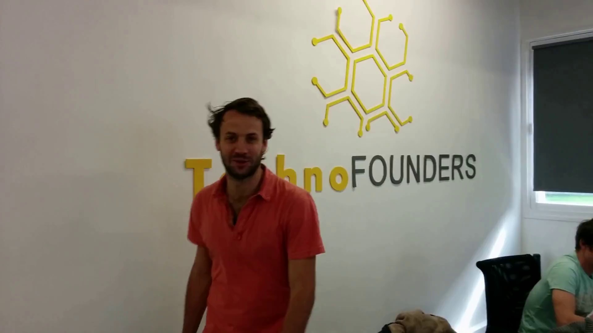
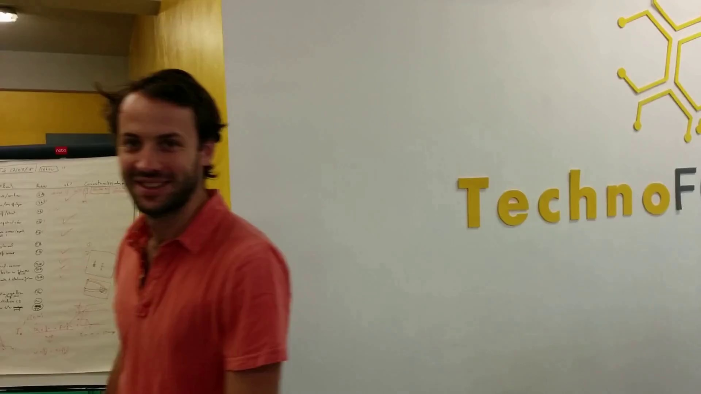

# Video Unscrambling

> Technical test solution: recover the most plausible temporal order of a tampered video without supervised labels.

This repository contains an end-to-end reconstruction pipeline for videos whose frames have been polluted with unrelated inserts and partially shuffled. The solution is intentionally framed like an interview submission: clear decomposition, reproducible commands, explicit tradeoffs, and a structure that can be extended without rewriting the core pipeline.

## Problem Statement

Given a corrupted video:

- some frames belong to the original sequence
- some frames are out-of-distribution insertions
- the temporal order is no longer reliable

The objective is to recover a coherent frame ordering and reconstruct a playable video.

## Proposed Approach

The pipeline is split into four deterministic stages:

1. `cluster`
   Separate likely inlier frames from inserted outliers using grayscale histogram features and K-Means clustering.
2. `match`
   Compare every inlier frame against every other frame with one of four descriptors: `RESNET`, `AKAZE`, `SIFT`, or `COMBO`.
3. `sequence`
   Convert pairwise similarity and motion into a frame ordering using a greedy search with lookahead, then refine it with local optimization heuristics.
4. `reconstruct`
   Reassemble the selected frames into a reconstructed `.mp4`.

This is an unsupervised heuristic pipeline rather than a learned ranking model. That tradeoff makes the solution easier to reason about in a technical test setting and easier to run on new examples without retraining.

## Repository Layout

```text
.
├── src/video_unscramble/
│   ├── cli.py
│   ├── core.py
│   ├── cluster_frames.py
│   ├── estimate_matches_motion.py
│   ├── compute_optimal_sequence.py
│   ├── reconstruct_frames.py
│   └── visualization.py
├── cluster_frames.py
├── estimate_matches_motion.py
├── compute_optimal_sequence.py
├── reconstruct_frames.py
├── execute_pipeline.sh
├── execute_all.sh
├── docs/assets/
└── utils/
```

## Why This Design

For an interview-style submission, I optimized for three things:

- readability: each stage has a single responsibility
- traceability: intermediate artifacts are saved to disk and can be inspected
- extensibility: descriptor choice is a parameter, not a rewrite

The heavy lifting lives in `src/video_unscramble/core.py`, while the command modules stay intentionally thin.

## CLI Usage

### Install

```bash
pyenv local 3.10.10
/Users/aissam/.local/bin/uv sync
```

### Run The Full Pipeline

The project exposes a [Typer](https://typer.tiangolo.com/) CLI with [Rich](https://rich.readthedocs.io/) help and step output, and the repository is set up to run with `uv`.

```bash
/Users/aissam/.local/bin/uv run video-unscramble pipeline \
  --method RESNET \
  --input corrupted_video.mp4 \
  --output-dir results \
  --fps 24 \
  --clusters 2 \
  --alpha 0.5 \
  --viz-tsne
```

### Run Individual Stages

```bash
/Users/aissam/.local/bin/uv run video-unscramble cluster --input corrupted_video.mp4 --output-dir results --clusters 2 --viz-tsne
/Users/aissam/.local/bin/uv run video-unscramble match --input-dir results/inliers --output results/matches_RESNET.npz --descr RESNET
/Users/aissam/.local/bin/uv run video-unscramble sequence --input results/matches_RESNET.npz --output results/sequence_RESNET.npy --alpha 0.5 --descr RESNET
/Users/aissam/.local/bin/uv run video-unscramble reconstruct --frames-dir results/inliers --sequence results/sequence_RESNET.npy --output results/reconstructed_video_RESNET.mp4 --fps 24 --save-frames-dir results/reconstructed_RESNET
```

### Legacy Shell Entry Points

These remain available for convenience:

```bash
bash execute_pipeline.sh RESNET
bash execute_all.sh
```

## Method Details

### 1. Frame Filtering

The first stage extracts all frames from the input video and computes grayscale histograms. These low-cost features are sufficient to separate many inserted frames from the dominant video distribution. The dominant cluster is treated as the inlier set for the rest of the pipeline.

Why this is reasonable:

- it is fast
- it is interpretable
- it removes obvious outliers before the expensive pairwise matching stage

### 2. Pairwise Frame Similarity

For each pair of inlier frames, the pipeline computes:

- a similarity score
- a motion estimate

Supported methods:

- `SIFT`: classical local descriptors
- `AKAZE`: efficient local binary descriptors
- `RESNET`: spatial feature matching from pretrained ResNet-50 feature maps
- `COMBO`: weighted fusion of global and local evidence

### 3. Sequence Recovery

The ordering stage builds a score matrix:

```text
score = matches - alpha * motion
```

It then recovers a plausible trajectory with:

- greedy selection with lookahead
- reversal penalties to reduce erratic jumps
- `two_opt` local refinement
- temporal smoothing
- weak-link removal

This is a heuristic search, not an exact solver. That is a deliberate choice: it keeps runtime reasonable while remaining easy to explain and debug.

### 4. Reconstruction

The final stage writes the recovered frame order to disk as:

- reordered JPEG frames
- reconstructed `.mp4`

## Result Snapshots

The repository includes a few committed sample artifacts from a previous run.

### Inserted / Corrupted Signal


### Inlier Frame After Clustering



### Reconstructed Output Frame



## What I Would Highlight In An Interview

- The solution is modular enough to swap descriptors or sequencing heuristics independently.
- The pipeline saves intermediate outputs, which makes failure analysis practical.
- The reconstruction step is intentionally simple because the real difficulty is in ranking frames, not writing video files.
- The main weakness is that the current approach is heuristic and can degrade on scenes with repetitive texture, hard cuts, or weak motion cues.

## Limitations

- clustering based on grayscale histograms is lightweight but not semantically rich
- pairwise matching is quadratic in the number of inlier frames
- the sequencing stage is heuristic, so there is no optimality guarantee
- abrupt scene changes can confuse both similarity and motion assumptions

## Extensions I Would Build Next

- replace the ordering heuristic with beam search or a graph optimization formulation
- add descriptor benchmarking with evaluation metrics on a labeled benchmark set
- cache feature extraction explicitly to speed up repeated experimentation
- add tests around score-matrix construction and sequence optimization
- expose confidence metrics for each reconstruction

## Summary

As a technical test submission, this project demonstrates:

- problem decomposition
- algorithm selection with explicit tradeoffs
- code organization suitable for review
- a runnable CLI for reproducible evaluation

If I were presenting this live, I would position it as a solid baseline system: pragmatic, inspectable, and strong enough to support a next iteration driven by measurement rather than guesswork.
